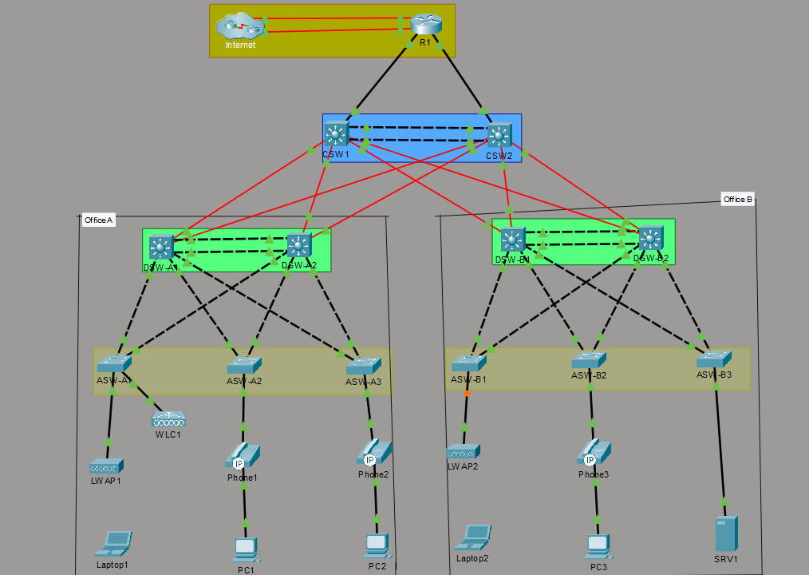

# Enterprise Campus Network Architecture

## Overview

This project showcases the design and implementation of a three-tier enterprise campus network in Cisco Packet Tracer. Rather than configuring individual technologies in isolation, the goal was to build a complete and interconnected environment where routing, switching, security, redundancy, wireless networking, and infrastructure services work together as they would in a real organization.

The topology represents two office locations connected through redundant core infrastructure and dual Internet providers. User devices, IP phones, wireless clients, and servers are placed into dedicated VLANs, allowing traffic to be segmented, secured, and managed efficiently while maintaining high availability across the network.

---

## Network Topology



The network follows a classic three-tier architecture consisting of Core, Distribution, and Access layers.

* **Core Layer** – Provides high-speed Layer 3 forwarding between major sections of the network and maintains resilient connectivity through a Layer 3 EtherChannel.
* **Distribution Layer** – Performs inter-VLAN routing, enforces routing policies, and provides gateway redundancy using HSRP so that end users continue to operate even if a distribution switch becomes unavailable.
* **Access Layer** – Connects end devices including PCs, IP phones, lightweight access points, and servers while applying security controls such as Port Security, DHCP Snooping, and Dynamic ARP Inspection.

The design also includes dual ISP connectivity, allowing Internet access to continue through an alternate path if the primary connection fails.

---

## Network Design Highlights

The topology was planned to reflect common enterprise networking practices rather than a minimal lab environment.

* Redundant Internet connectivity through two ISP links
* Dedicated Core, Distribution, and Access switching layers
* Layer 2 and Layer 3 EtherChannels to increase bandwidth and eliminate single points of failure
* Separate VLANs for user devices, voice traffic, wireless clients, servers, and network management
* High availability through HSRP with carefully aligned spanning-tree root bridge placement
* Wireless integration using a Wireless LAN Controller and Lightweight Access Points
* Centralized services including DHCP, DNS, NTP, Syslog, SNMP, FTP, and SSH

---

## Technical Implementation

### Switching and Segmentation

VLANs were used to logically separate different categories of devices and reduce unnecessary broadcast traffic. Trunk links carry multiple VLANs between switches, while VTP simplifies VLAN management across the switching infrastructure. EtherChannel bundles multiple physical links into a single logical interface to improve both throughput and resiliency.

### Routing and Redundancy

Inter-VLAN communication is provided by the Distribution layer, while OSPF dynamically exchanges routes between Layer 3 devices. HSRP supplies redundant default gateways so clients maintain connectivity during device failures. Static default routes and floating backup routes provide Internet failover between the two WAN connections.

### Infrastructure Services

The network includes centralized DHCP address assignment, DNS name resolution, NTP time synchronization, SNMP monitoring capabilities, Syslog message collection, secure SSH administration, and NAT/PAT for communication with external networks.

### Wireless Networking

Wireless connectivity is managed through a Wireless LAN Controller with Lightweight Access Points operating under centralized control. A dedicated wireless VLAN and WPA2 security configuration provide segmented and authenticated access for wireless clients.

### Security

Several security mechanisms were implemented to protect the access layer and management plane:

* Extended Access Control Lists to restrict unnecessary traffic
* Port Security to prevent unauthorized devices from connecting
* DHCP Snooping to block rogue DHCP servers
* Dynamic ARP Inspection to mitigate ARP spoofing attacks
* SSH-only remote administration for secure device management

### IPv6

The project also includes dual-stack IPv4/IPv6 deployment with IPv6 addressing and static routing to demonstrate readiness for modern enterprise environments while maintaining compatibility with existing IPv4 services.

---

## Validation and Testing

After configuration, each major component of the network was verified through operational testing and CLI validation. The `screenshots` directory contains evidence confirming successful implementation of:

* VLAN creation and trunk operation
* Layer 2 and Layer 3 EtherChannels
* HSRP active and standby states
* OSPF neighbor relationships and learned routes
* Routing table population
* DHCP address allocation
* NAT translations
* IPv6 interface configuration
* Port Security
* DHCP Snooping
* Dynamic ARP Inspection
* SSH remote access
* Wireless LAN Controller configuration
* Wireless security settings

---

## Repository Structure

```text
enterprise-campus-network-architecture/
├── packet-tracer/
│   └── Enterprise-Campus-Network.pkt
├── screenshots/
│   └── Verification screenshots
├── topology/
│   └── Topology_Overview.png
├── README.md
└── LICENSE
```

---

## Technologies Used

* Cisco Packet Tracer
* Cisco IOS
* VLANs and IEEE 802.1Q Trunking
* VTP
* EtherChannel (PAgP and LACP)
* Rapid PVST+
* OSPF
* HSRPv2
* DHCP and DHCP Relay
* DNS
* NTP
* SNMP
* Syslog
* FTP
* SSH
* Static NAT and Dynamic PAT
* IPv4 and IPv6
* Wireless LAN Controller (WLC)
* Access Control Lists (ACLs)
* Port Security
* DHCP Snooping
* Dynamic ARP Inspection (DAI)

---

## Project Objective

The purpose of this project was to design and validate a resilient enterprise network that combines routing, switching, redundancy, security, wireless networking, and infrastructure services into a single cohesive solution. It serves as a practical demonstration of enterprise networking concepts and hands-on Cisco configuration skills using Cisco Packet Tracer.
